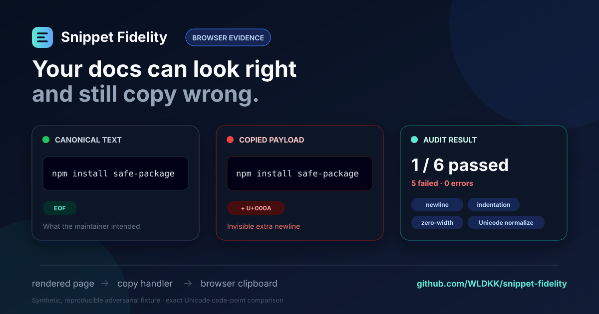

# Snippet Fidelity

[](https://github.com/WLDKK/snippet-fidelity/actions/workflows/ci.yml)
[](https://github.com/WLDKK/snippet-fidelity/releases)
[](https://www.npmjs.com/package/snippet-fidelity)
[](https://github.com/marketplace/actions/snippet-fidelity)
[](LICENSE)

**Catch invisible copy-button corruption before users paste broken commands from your docs.**

Snippet Fidelity checks whether a rendered documentation site's **Copy code** controls preserve the
exact text maintainers intended to ship.

[Try one URL](#try-it-in-one-workflow-step) ·
[Request a public audit](https://github.com/WLDKK/snippet-fidelity/issues/new?template=audit_request.yml)
· [Add a source-aware gate](#github-action) · [See real-world evidence](#real-world-evidence) ·
[Read the upstream case study](docs/upstream-case-obsidian-webpage-export-2026-08-27.md)

It drives a real Chromium page, clicks a real copy control, records the
`navigator.clipboard.writeText` payload when available, reads the browser clipboard, and compares
both observations at Unicode code-point precision. It detects changes such as terminal newlines,
indentation loss, tab/space substitution, invisible characters, punctuation substitution, and
Unicode normalization.



The image above comes from the repository's synthetic adversarial fixture, not a claimed production
incident. Run it locally to reproduce one passing control and five intentional clipboard failures:

```shell
pnpm fixture
# In another terminal:
node dist/cli.js audit --config examples/adversarial-fixture.config.json
```

The audit reports the failure category and first differing Unicode code point without printing the
full snippet by default. See [Development](#development) for the complete verification gate.

> Project status: public pre-release (`v0.4.0`). The evidence model is usable, but the API may
> change while the conformance contract is being validated.

## Start with your docs

Choose the smallest useful first step:

- **Have a public documentation URL?**
  [Request a public audit](https://github.com/WLDKK/snippet-fidelity/issues/new?template=audit_request.yml).
  The audit is bounded to copy controls near code blocks, never executes copied text, and publishes
  its evidence and limitations for review.
- **Want a no-config CI check?** Add the workflow below. It uses the rendered code block as the
  baseline and is best for reconnaissance and regression triage.
- **Need a dependable release gate?** Check in a canonical snippet file and use the
  [source-aware GitHub Action](#github-action) so source, rendered DOM, handler payload, and browser
  clipboard are compared explicitly.

## Try it in one workflow step

Run a real Chromium audit against any public documentation URL—no checkout or configuration file
required:

```yaml
name: snippet-fidelity

on:
  workflow_dispatch:

permissions:
  contents: read

jobs:
  audit:
    runs-on: ubuntu-latest
    steps:
      - uses: WLDKK/snippet-fidelity@v0
        with:
          url: https://docs.example.com/
```

The workflow summary lists every discovered copy control and highlights fidelity failures. URL mode
uses the rendered code block as its expected text, so treat it as reconnaissance. For release gates,
continue with a checked-in canonical source below.

If you would rather see the evidence before adding a workflow,
[open an audit request](https://github.com/WLDKK/snippet-fidelity/issues/new?template=audit_request.yml)
with a public page. Private or authenticated pages are intentionally out of scope for public audits.

## Why this is different

Markdown linters inspect source. Documentation test runners execute examples. Clipboard libraries
implement copy behavior. Snippet Fidelity tests a different boundary:

```text
canonical snippet -> rendered page -> copy handler -> browser clipboard
```

Reports do not include full expected or copied text by default. They contain SHA-256 fingerprints,
lengths, categorized findings, and a bounded escaped context around the first difference.

For broad documentation procedure, UI, API, or executable-example testing, use a general framework
such as [Doc Detective](https://github.com/doc-detective/doc-detective). For low-level clipboard
fixtures inside an existing Playwright suite, consider
[Playwright Clipboard](https://github.com/vrknetha/playwright-clipboard). Snippet Fidelity stays
narrow: reusable source-to-copy evidence for rendered documentation code blocks.

## Real-world evidence

- A [public-site pilot](docs/pilot-study-2026-08-26.md) exercised three maintained documentation
  sites. Astro Starlight passed three discovered checks; Material for MkDocs and Doc Detective
  exposed consistent rendered-DOM transformations that may be intentional. The report treats them as
  reconnaissance findings, not defect claims.
- An [Obsidian Webpage Export case](docs/upstream-case-obsidian-webpage-export-2026-08-27.md) uses a
  source-aware audit to validate a fix for a real reported copy-button failure. The upstream pull
  request remains open, so this is evidence for the proposed fix—not a claim of adoption.
- The repository's adversarial fixture keeps one passing control beside five deliberate failures,
  making newline, indentation, whitespace, punctuation, and Unicode regressions reproducible.

These examples also show the project's reporting rule: an observed mismatch is not automatically a
bug. A release-blocking claim requires a maintainer-owned canonical source contract.

## Evidence levels

Snippet Fidelity labels evidence instead of presenting every check as equivalent:

- `canonical-text`: expected text is declared directly in configuration.
- `canonical-file`: expected text is loaded byte-for-byte as UTF-8 from a repository file.
- `rendered-dom`: expected text comes from the rendered `<code>` element. This proves DOM-to-copy
  fidelity, not source-to-render fidelity.

Use an explicit configuration for release gates. Direct URL discovery is useful for reconnaissance
and regression triage.

Each check also emits a versioned **proof graph** with four fixed stages: canonical source, rendered
DOM, handler payload, and browser clipboard. A stage is labeled `available`, `unavailable`, or
`not-observed`; every stage pair has an `exact`, `mismatch`, or `not-comparable` edge. Current
runtime checks observe either canonical source or rendered DOM as their baseline, plus the available
copy probes. This makes optional capability gaps and handler-to-clipboard transformations visible
without claiming that an unobserved stage passed.

## Quick start

Requirements: Node.js 22 or newer and Chromium. Install the package and browser:

```shell
npm install --save-dev snippet-fidelity
npx playwright install chromium
npx snippet-fidelity audit https://docs.example.com/
```

The versioned GitHub release archive remains available when registry installation is unsuitable.

To run from a cloned checkout instead:

```shell
pnpm install
pnpm exec playwright install chromium
pnpm build
node dist/cli.js audit https://docs.example.com/
```

Direct URL mode searches for accessible copy controls near `<pre><code>` blocks and prints a
Markdown report.

For source-aware checks, create `snippet-fidelity.config.json`:

```json
{
  "$schema": "https://raw.githubusercontent.com/WLDKK/snippet-fidelity/v0/schema/config.schema.json",
  "version": 1,
  "baseUrl": "https://docs.example.com/",
  "pages": [
    {
      "url": "getting-started/",
      "checks": [
        {
          "id": "install-command",
          "button": "#install-command button[aria-label='Copy code']",
          "expected": { "file": "./snippets/install.sh" },
          "probe": "both"
        }
      ]
    }
  ]
}
```

Then write CI-friendly reports:

```shell
node dist/cli.js audit --config snippet-fidelity.config.json \
  --reporter markdown --reporter json --reporter junit \
  --output-dir artifacts
```

## GitHub Action

Use the repository directly as a merge gate after committing a source-aware configuration:

```yaml
- uses: actions/checkout@v4
- uses: WLDKK/snippet-fidelity@v0
  with:
    config: snippet-fidelity.config.json
    output-dir: artifacts/snippet-fidelity
```

See the [GitHub Action guide](docs/github-action.md) for inputs, report upload, failure behavior,
and pinning guidance.

The action publishes a Markdown job summary and one GitHub error annotation per non-passing check by
default, so reviewers can see the failure category and first differing code point without opening
raw logs. It also exposes `outcome`, `total`, `passed`, `failed`, and `errors` outputs for
downstream workflow steps. UI publishing can be disabled with `github-summary: false` without
disabling these outputs.

On PowerShell, put the command on one line or use PowerShell's backtick continuation character.

## Probe modes

- `clipboard` (default): the browser clipboard must match.
- `handler`: the captured `navigator.clipboard.writeText` argument must match. This is useful when a
  runtime cannot expose clipboard read permission, but it does not prove an OS clipboard round-trip.
- `both`: both observations must exist and match.

Checks run sequentially because the clipboard is shared mutable state. A selector must match exactly
one button; ambiguous selectors fail safely.

## Exit codes

- `0`: every required probe passed.
- `1`: at least one fidelity check failed or encountered a page/probe error.
- `2`: invalid arguments, configuration, or tool startup failure.

## What it does not do

- It never executes copied commands or code.
- It does not rewrite, normalize, or "fix" clipboard content.
- It is not a generic clipboard manager or Clipboard API conformance suite.
- It does not claim source fidelity when expected text came from the rendered DOM.
- It does not click arbitrary page controls; discovery is limited to copy-named controls near
  matching code blocks.
- It does not test pointer hit-targeting or visual overlap. Once a rendered copy control is found,
  the audit activates that intended control directly to isolate clipboard fidelity.

## Current limitations

- Chromium is the only supported browser in `0.4.x`.
- The composite GitHub Action is validated on Linux GitHub-hosted runners. The standalone CLI and
  library are the supported integration path for other environments.
- Copy implementations that do not use `navigator.clipboard.writeText` can still be tested through
  the browser clipboard, but will not produce a handler-payload observation.
- Source files are read as exact UTF-8 text. A final newline in the file is part of the contract.
- Browser and operating-system clipboard layers may themselves transform line endings. That is
  reported as observed rather than normalized away.
- Automatic discovery uses heuristics. Explicit selectors are required for a dependable release
  gate.

## Support

- Use the
  [bug report form](https://github.com/WLDKK/snippet-fidelity/issues/new?template=bug_report.yml)
  for incorrect results or crashes.
- Use the
  [feature request form](https://github.com/WLDKK/snippet-fidelity/issues/new?template=feature_request.yml)
  for focused additions to the fidelity contract.
- Use the
  [public audit request](https://github.com/WLDKK/snippet-fidelity/issues/new?template=audit_request.yml)
  to nominate a public documentation page for bounded reconnaissance.
- Report vulnerabilities privately through
  [GitHub Security Advisories](https://github.com/WLDKK/snippet-fidelity/security/advisories/new).

## Development

```shell
pnpm format:check
pnpm typecheck
pnpm test
pnpm build
npm pack --dry-run
```

`pnpm verify` runs the complete local gate. The end-to-end tests serve an adversarial fixture site
containing one correct copy control and five intentional regressions.

To inspect the fixture manually, run `pnpm fixture` in one terminal and then run:

```shell
node dist/cli.js audit --config examples/adversarial-fixture.config.json
```

The expected result is one pass and five failures; a zero exit code would mean the fixture stopped
testing the intended regressions.

See [architecture](docs/architecture.md), [threat model](docs/threat-model.md),
[contribution guide](CONTRIBUTING.md), and the dated [competitor ledger](docs/competitor-ledger.md)
for the project's scope and evidence. The [public-site pilot study](docs/pilot-study-2026-08-26.md)
records cross-project results, limitations, and a defect found and fixed in Snippet Fidelity itself.
The
[Obsidian Webpage Export upstream case](docs/upstream-case-obsidian-webpage-export-2026-08-27.md)
documents a source-aware validation and an open fix proposal without presenting it as adopted.

## License

MIT
